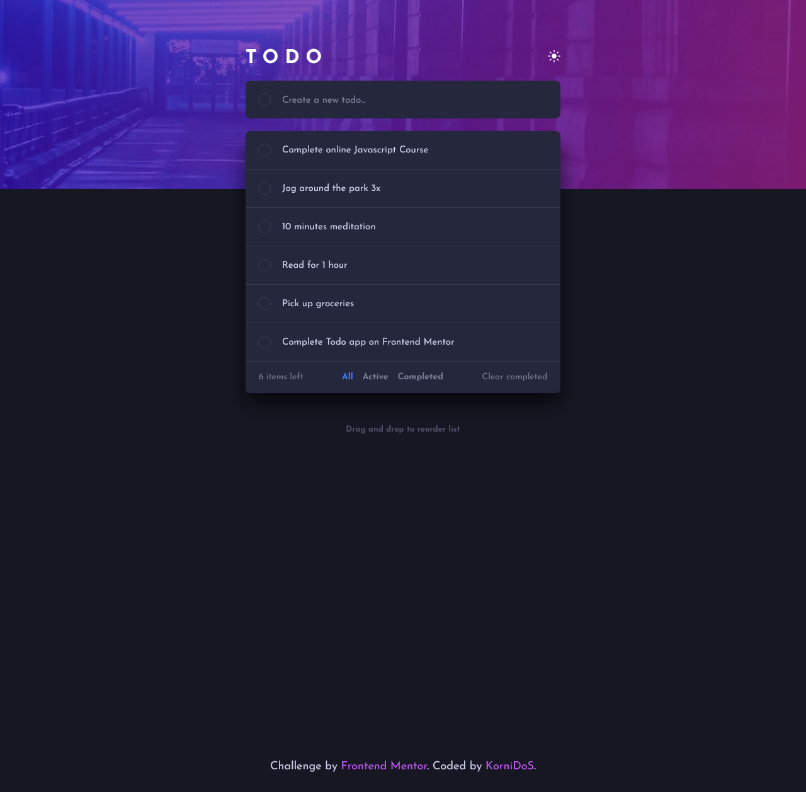
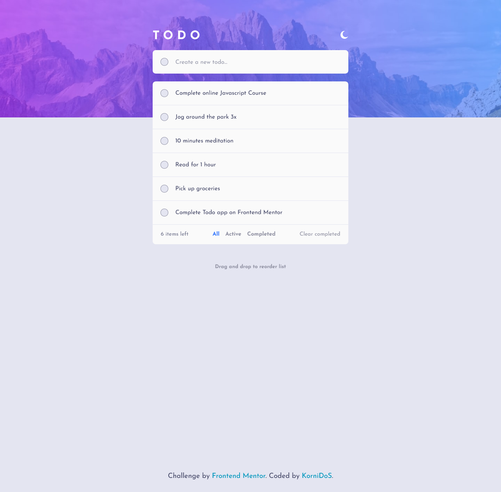

# Frontend Mentor - Todo app solution

This is a solution to the [Todo app challenge on Frontend Mentor](https://www.frontendmentor.io/challenges/todo-app-Su1_KokOW). Frontend Mentor challenges help you improve your coding skills by building realistic projects. 

## Table of contents

- [Overview](#overview)
  - [The challenge](#the-challenge)
  - [Screenshot](#screenshot)
  - [Links](#links)
- [My process](#my-process)
  - [Built with](#built-with)
  - [What I learned](#what-i-learned)
  - [Continued development](#continued-development)
  - [Useful resources](#useful-resources)
- [Author](#author)


## Overview

### The challenge

Users should be able to:

- View the optimal layout for the app depending on their device's screen size
- See hover states for all interactive elements on the page
- Add new todos to the list
- Mark todos as complete
- Delete todos from the list
- Filter by all/active/complete todos
- Clear all completed todos
- Toggle light and dark mode
- **Bonus**: Drag and drop to reorder items on the list

### Screenshot
Dark theme


Light theme



### Links

- Solution URL: [Add solution URL here](https://your-solution-url.com)
- Live Site URL: [Add live site URL here](https://your-live-site-url.com)

## My process

### Built with

- Semantic HTML5 markup
- CSS custom properties
- Flexbox
- Mobile-first workflow
- Vanilla Javascript
- SortableJS


### What I learned
- How to use array methods
- How to use mouseleave and mouseenter events
- How to save data with LocalStorage API
- How to style the page for 2 themes
- How to add gradient border to a checkbox
- How to select and play with ::before CSS pseudo-elements in Javascript


```css
  .gradient-border::before {
        visibility: var(--visibility);
        content: "";
        position: absolute;
        top: -2px;
        left: -2px;
        border-radius: 50%;
        width: 1.5em;
        height: 1.5em;
        padding: 1px;
        background: linear-gradient(45deg, hsl(192, 100%, 67%), hsl(280, 87%, 65%));
        -webkit-mask:
        linear-gradient(#fff 10px 10px) content-box,
        linear-gradient(#fff 10px 10px);
        -webkit-mask-composite: xor;
        mask-composite: exclude;
    }
```

```js
const gradientCheckboxBorder = () => {
    const gradient_borders = document.querySelectorAll(".gradient-border");
    gradient_borders.forEach(elem => {
        elem.addEventListener('mouseover', () => {
            elem.style.setProperty('--visibility', 'visible');
        })

        elem.addEventListener('mouseleave', () => {
            elem.style.setProperty('--visibility', 'hidden');
        })
    })
}
```


### Continued development

I would like to focus on improving my array methods usage, design patterns, functions and learning how to write modular, clean Javascript.


### Useful resources

- [MDN](https://developer.mozilla.org/en-US/docs/Web/API/EventTarget/addEventListener) - Helped me to better understand some issues i've been through (eg. when you want to attach a function that has parameters in an event listener, you actually have to use the syntax `function(){exampleFunc(arg1, arg2, ...)}` unlike when there are no parameters needed (eg. `button.addEventListener('click', someFunction)`).
- [Drag and drop resource 1](https://ramya-bala221190.medium.com/dragging-dropping-and-swapping-elements-with-javascript-11d9cdac2178) - Amazing article that explains drag and drop
- [Drag and drop resource 2](https://github.com/SortableJS/Sortable) - Amazing JS framework for drag and drop functionality

## Author

- Frontend Mentor - [@KorniDoS](https://www.frontendmentor.io/profile/KorniDoS)


